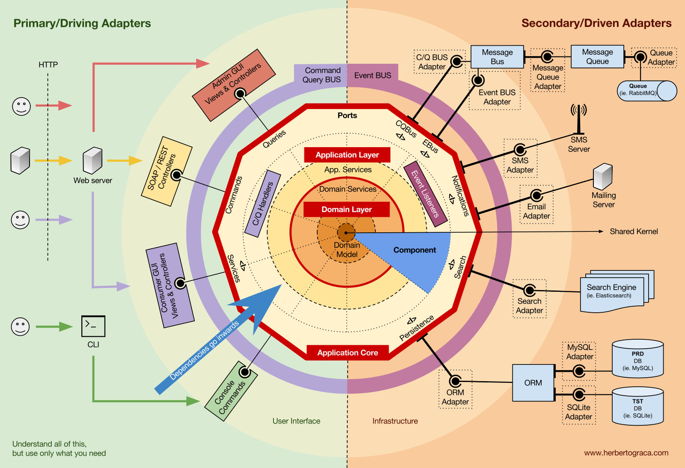

# Kotlin Spring Boot Hexagonal Architecture

## 개요

헥사고날 아키텍쳐와 탐구 생활

## 설계

* `Primary-adapter == inbound -> endpoint, event` 와 동일하다.
* `Seconadry-adpater == outbound -> persistence, external` 와 동일하다.
* `Use-case` 와 `Service` 는 1:1 관계를 가지게 하여 인터페이스 분리 원칙을 지키도록 한다.
* `Inbound` 네이밍 룰은 이해하기 쉽도록 `CRUD`로 시작하도록 한다.
* `Outbound` 네이밍 룰도 이해하기 쉽도록 `Read~~`, `Write~` 로 시작하도록 한다.
* 도메인에서는 한개 엔티티를 지정하여 `Bounded-context` 내 가능한 한개의 루트 엔티티를 가지도록 한다.
* 가능하다면 도메인 속성은 VO로 선언하여 관리하고 검증을 하도록 한다.

## 총평 및 의견

* 굉장히 이상적이고 **개발자가 업무 하며 발생할 수 있는 부분들을 보다 쉽게 해결하기 위한 것들을 레이어로 구현으로 옮긴 것 처럼 느껴진다.**
* 즉 인프라, 라이브러리 등을 코드나 추상화 등으로 해결을 하고 싶어하는거 같은데 흠... 너무 과투자 아닌가?
    * 이 부분은 팀에서 어느정도 타협점을 가지고 굳이 안해도 되는 부분은 안하는게 좋아 보임.
    * 일반적인 레이어드 아키텍쳐에서 발생할 수 있는 부분은 헥사고날 아키텍쳐로 와도 개발자가 누구냐에 따라서 똑같이 발생할 수 있을거 같다.
* 현실과 알수없는 미래의 어떠한 간극이랄까...? 근데 이건 기술 부채의 영역도 아니니 대출은 아니네?
* 개인적으로는 진행 하다보니 풀 프레임워크인 스프링과는 **궁합이 좋지 않다고 생각한다**.
    * 아마 다른 풀 프레임워크인 장고나 라라벨 등도 똑같지 않을까 싶고 경량 프레임워크에서는 확실히 좋을것 같다.
    * 이거 이거 다른 프레임워크에서는 어떨지 스윽 했을때...
        * `Django`: 아니?! 장고에 이런 지랄을...
        * `Laravel`: 지랄222222222222222222
        * `FastAPI`: 확실히 경량 프레임워크가 잘 맞음.
        * `Gin`: 역시 경량 프레임워크에서 잘 맞음.

* 레이어드 아키텍쳐와 비교
    * 장점
        * 비지니스 로직의 중심인 `Application`과 `Domain`에서 코드는 보다 직관적이 되고 도메인 중심으로 집중.
        * 책임을 각각 분리하여 잘 분리 정돈된 구조와 코드 작성 가능.
        * 프레임워크 등에서 제공하는 숨겨져 있어 아는 사람만 아는 기능이 없음.
    * 단점
        * 물리적 시간이 더 필요.
        * 파일 개수가 많아짐.
        * 구현 난이도이 보다 높음.
        * 생각해야 되는 부분이 보다 많음.
        * 의존성은 어디까지? 레이어, 모듈 분리는 어디까지? 도메인은? ...등 수많은 의견 맞추기 필요
        * 아키텍쳐와 DDD에 대해서 팀원들 전체 이해도 맞추기 힘듬. 이론적으로나 실제 구현으로나 꽤 높은 러닝커브가 있음.
        * 극혐하는 사람이 있을 수 있음.

## 기록

* 어댑터 경우 지금 구성에서 테스트 필요를 못 느끼겠어서 우선 삭제함.
    * 모킹을 하지 않고 해서?
    * 아니면 구조상 그런건가?